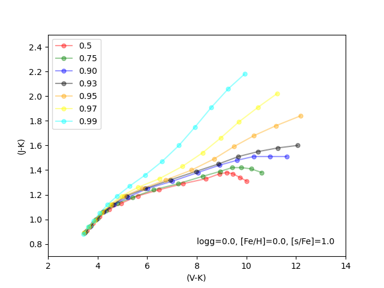

## 已完成

- 读文献找可以用来计算S型星C/O的方法

- 将预测到的219颗S型星与SIMBAD交叉，得到40个共同源，每一个都去找了它们的出处，但是也没有发现有用的信息。

- 最终找到一篇可以用V-K 和 J-K来估计S型星的C/O的一篇文章，其中MARCS网格如下：

  

## 遇到的问题

- 可否用LAMOST的星等信息来做？

## 下周计划

- 继续读文献
- 得到C/O的结果

