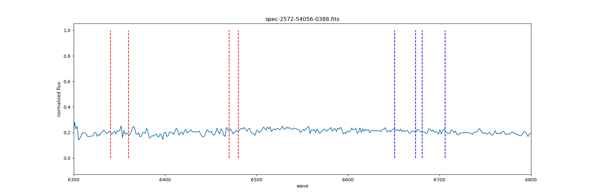
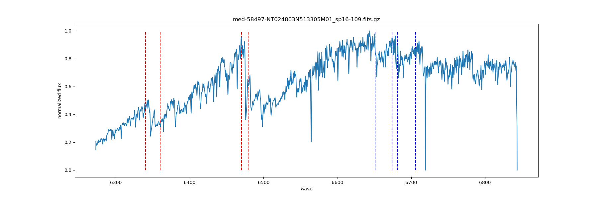
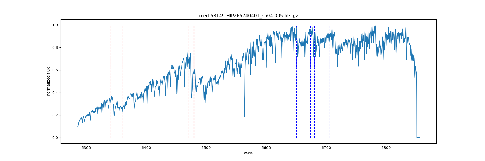
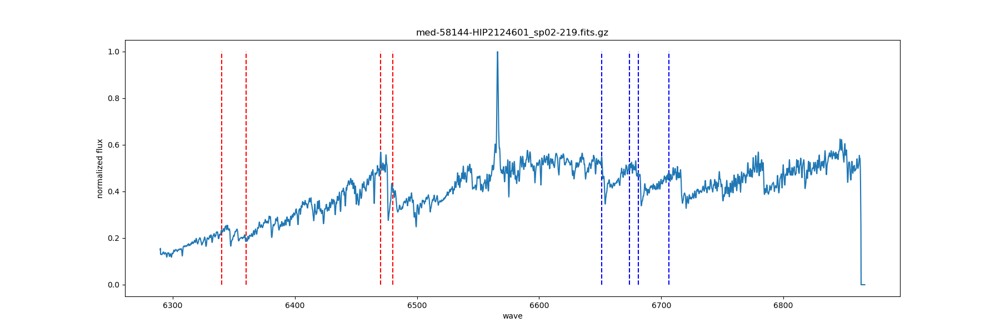

# 第2周汇报

- 将SDSS的M巨星光谱下载下来之后，大多都是类似于下面这种，跟LAMOST低分辨的光谱比较相似，看不出明显的ZrO特征，所以放弃了在SDSS中寻找S型星的想法。

  

- 由于目前找到的S型星只有120颗，所以仔细分析了S型星的光谱，主要分为以下三类：

1. 有明显的ZrO特征，有$H_{\alpha}$吸收线

2. ZrO特征不明显，有$H_{\alpha}$吸收线

3. ZrO特征不明显，有$H_{\alpha}$发射线

经过重新在LAMOST DR7中分辨的总星表寻找S型星，总共找到219颗S型星。其中第一类有104颗，第二类有102颗，第三类有13颗。

- 下周的工作计划：检验MARCS模型是否可以用来测S型星的参数