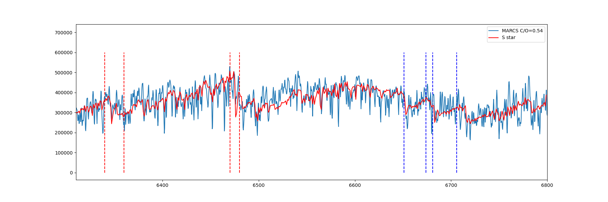

# 第3周汇报

- 目前理解的s过程增强的恒星和S型星的区别：两者都是发生在AGB阶段，这个阶段是所有低到中等质量的恒星（1-8太阳质量）生命后期所经历的过程。也就是光谱类型可以从M到B，都可以发生s过程增强，但是S型星只是M型星演化为碳星的一个中间产物。所以我觉得s过程增强的恒星应该包含S型星。

- 上周看到的应该就是$H_{\alpha}$发射线，在这个网页里针对S型星的介绍[S型星的发射线](https://baike.baidu.com/item/恒星光谱分类)，但是还没有想明白为什么会有$H_{\alpha}$发射线，还需要进一步读文献。

- 将MARCS模型光谱利用iSpec降分辨率之后，与S型星对比（APOGEE的参数）。画出来的对比图如下

  

- 下周工作计划：读文献找到一些利用S型星可以做的分析。