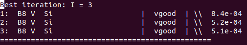
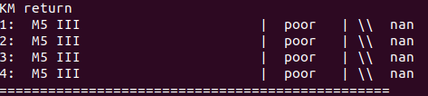
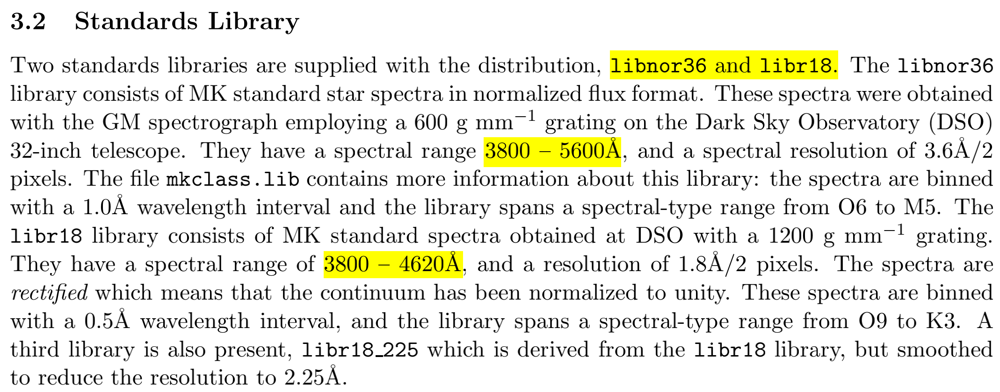

# 第5周汇报

## 已完成

- 读文献

- 研究MKCLASS，利用这篇文献（A plethora of new, magnetic chemically peculiar stars from LAMOST DR4）中的一颗CP星做了一下测试，得到的结果如下：

  |     designation     | SpType       | LAMOST DR7Low pipeline | LAMOST DR7 Low MKCLASS | LAMOST DR7 Med MKCLASS |
  | :-----------------: | ------------ | ---------------------- | ---------------------- | ---------------------- |
  | J013031.12+454021.1 | B9 IV CrEuSi | A2V                    | B8 V Si                | M5 III                 |

  DR7低分辩
  
  

  DR7中分辨
  
  

  用MKCLASS分类的LAMOST DR7中分辨光谱，结果差的比较大，是否是因为MKCLASS的标准库的波长范围不在LAMOST中分辨的范围内？

  

## 遇到的问题

- MKCLASS是否可以用来分类LAMOST DR7中分辨光谱？

## 下周计划

- 继续读文献
- 找可以用来分析S型星的方法

