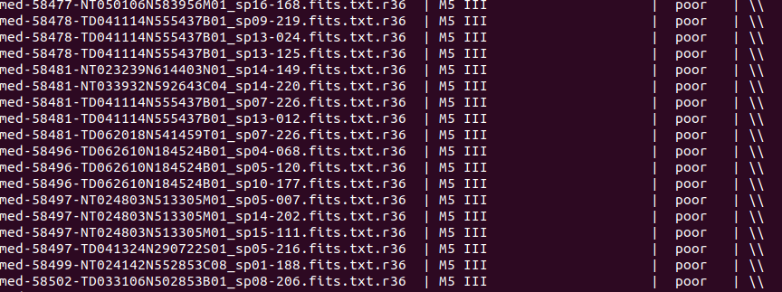

# 第6周汇报

## 已完成

- 读文献：CH、Ba、extrinsic S stars都处于双星系统中，均为红巨星，且都有一个白矮星的伴星，区别是CH星中CH band强，Ba星中Ba线强，extrinsic S stars中ZrO强。

- 利用MKCLASS分类出219颗Sstars均为M5III，结果如下

- 杜冰师姐得到的参数

## 遇到的问题

- 怎么判断哪类星应该做哪类分析？

## 下周计划

- 继续读文献
- 着手做一下分析，看一下结果

