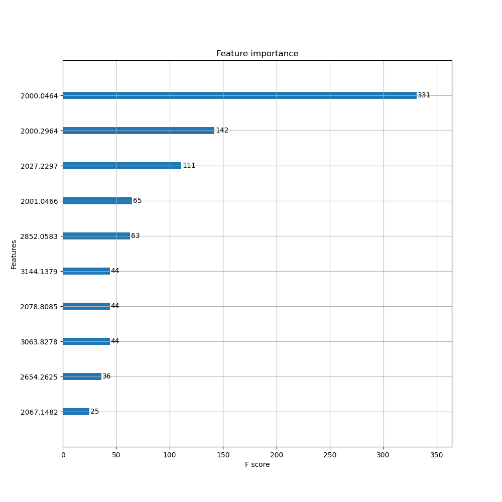
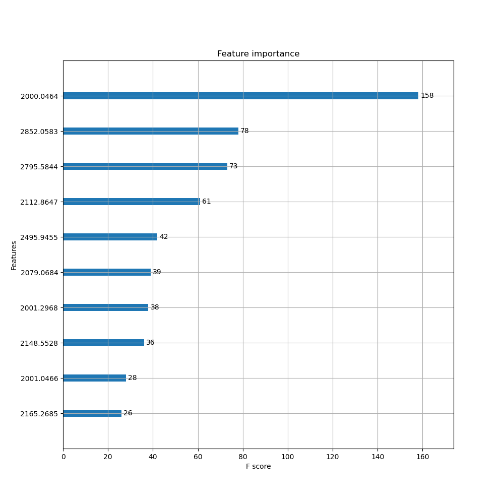
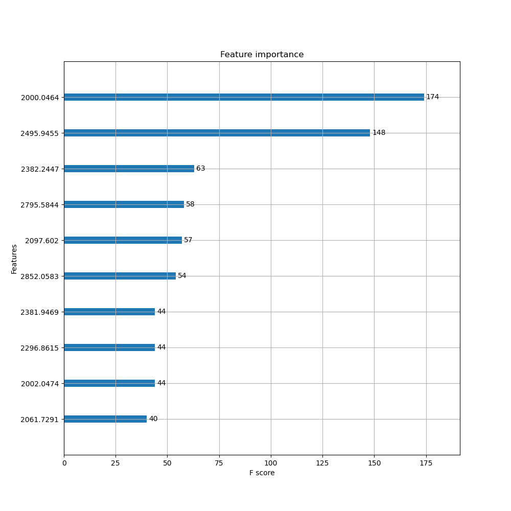
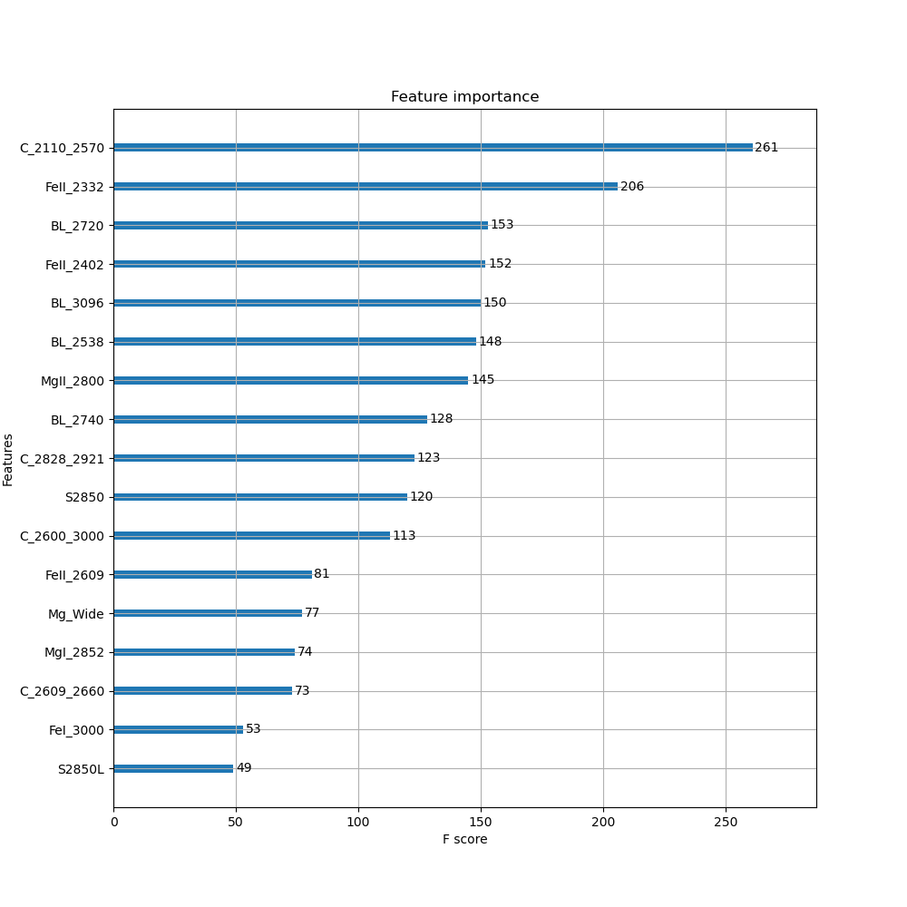
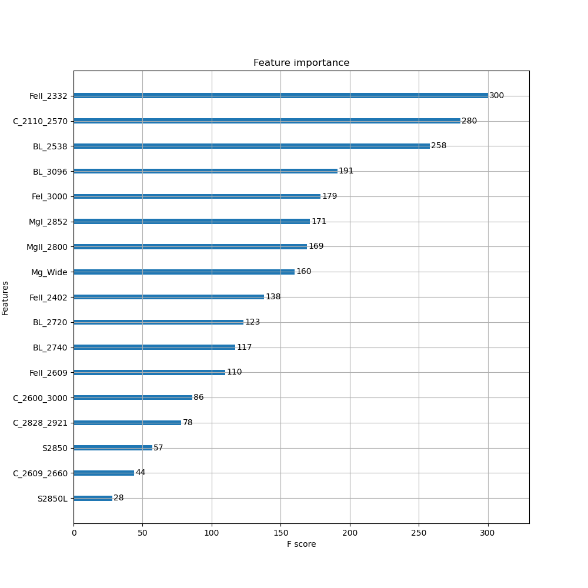
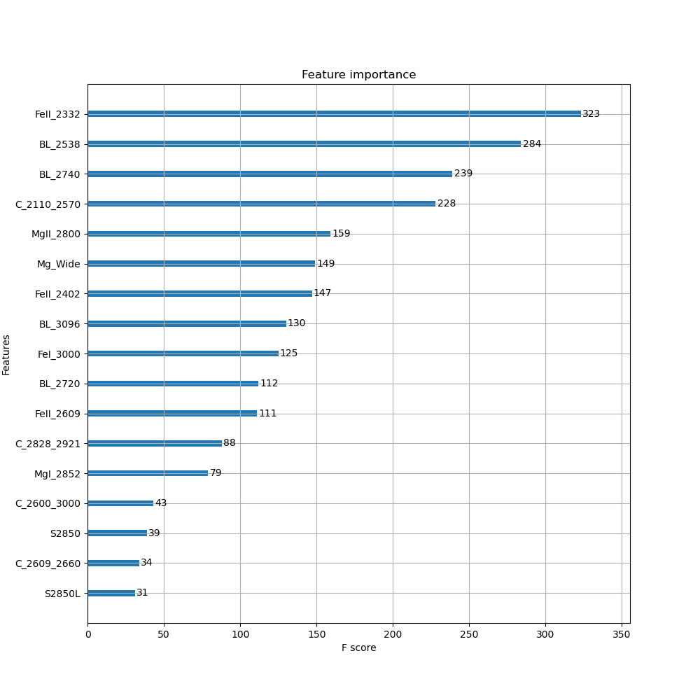

## 1.本周完成

- 利用 XGBoost 完成以 UVBLUE 光谱为输入，分别以 $T_{eff}$, $logg$ 和 $[M/H]$ 为标签的回归任务，最重要的特征如下：

$T_{eff}$:

$logg$:

$[M/H]$:

- 利用 XGBoost 完成以 UVBLUE 光谱的 11 个线指数和 6 个连续谱指数为输入，分别以 $T_{eff}$, $logg$ 和 $[M/H]$ 为标签的回归任务，最重要的特征如下：

$T_{eff}$:

$logg$:

$[M/H]$:

## 2.问题所在

- 尚未分析出特征和物理意义之间的联系
- 对于 XGBoost 的参数和原理尚未完全理解

## 3.下周计划

- 理解 XGBoost 参数和原理，调参后重新训练模型
- 将 $logg$ 和 $[M/H]$ 作为分类问题进行模型的训练
- 结果分析 + 数据可视化
