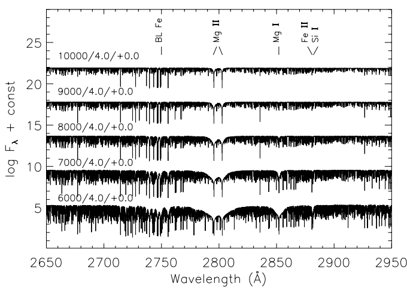
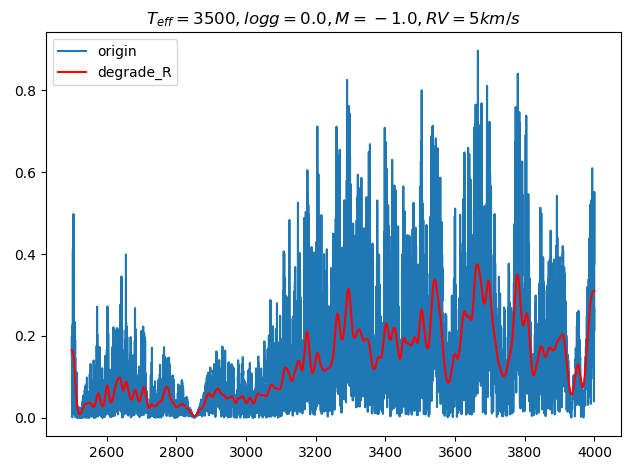

# 第2周汇报

## 1.本周完成

**文献梳理**

- UVBLUE: A NEW HIGH-RESOLUTION THEORETICAL LIBRARY OF ULTRAVIOLET STELLAR SPECTRA
- An extensive library of 2500–10500 Å synthetic spectra
- A Stellar Spectral Flux Library: 1150–25000 Å
- SYNTHETIC MID-UV SPECTROSCOPIC INDICES OF STARS

**光谱展示**

1. UVBLUE

2. 2500 - 10500 Å

**概述**

- UVBLUE 在背景介绍里详细地阐述了紫外波段的研究现状
  - 早期：Voyager, OAO, IUE
  - 中期：HST 上的 HUT 和 GHRS
  - 后期：STIS (取代 GHRS，高分辨率， 1900 - 3300 Å)；FUSE (R ≈ 20000，912 - 1900 Å，莱曼极限)

- 2500 - 10500 Å
  - 参数空间大
  - 新模型

- 1150 - 25000 Å
  - 观测光谱库
  - 标准库

  

## 2.有什么问题

- 紫外波段的应用？
- 模拟可在地面光学观测到的高红移星系的紫外线发射
- 依据现有的数据，光谱库该如何构建？

  

## 3.下周计划

- 根据线表标出强线
- 查看线指数并定义区分
- 继续梳理文献，比较不同光谱库的特点
- 沿着论文中的参考继续展开，挖掘更多紫外波段光谱的相关信息
