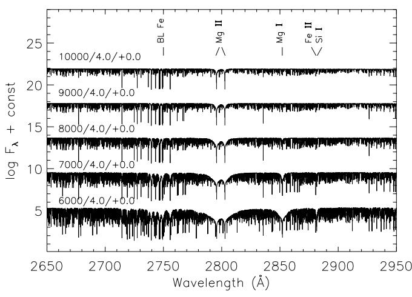

# 第3周汇报

## 1.本周完成

- UVBLUE 数据结构理解 + 画图

| Features | Wavelength |
|:---------| :--------- |
| Mg II doublet| 2800 Å |
| Mg I     |     2852 Å |
|blend of Fe I & Fe II|2720 Å|
| Fe II    |     2880 Å |
| Si I     |     2881 Å |

  
  

- 深入理解降分辨率操作
- 搜集并粗读**谱线证认**相关的论文

  

## 2.有什么问题

- 这样的光谱拉平是怎么实现的？

- 近紫外 (2500 - 3000 Å) 和光学 (3000 - 4000 Å) 是否应该拆开讨论研究？

- 谱线证认 -- Spectra Line Identification?

  

## 3.下周计划

- 精读谱线证认的相关论文
- 选择合适的线表，完成对 2 个合成光谱库小范围光谱的初步谱线证认
