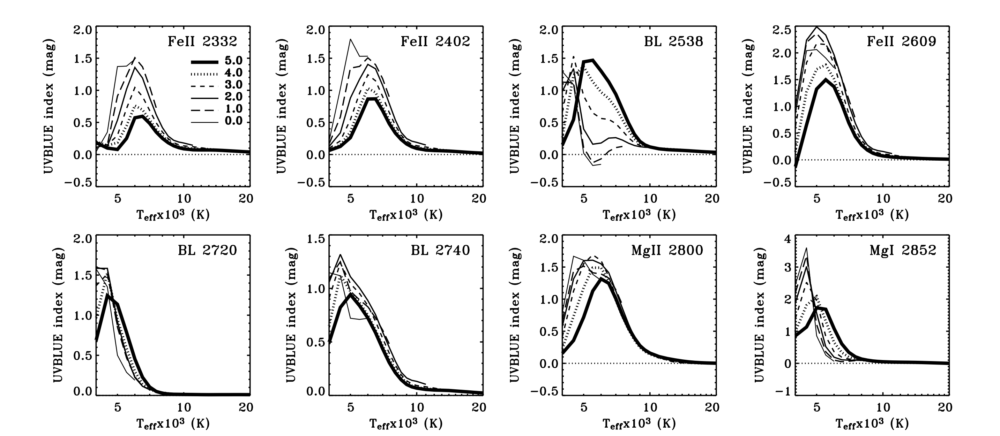
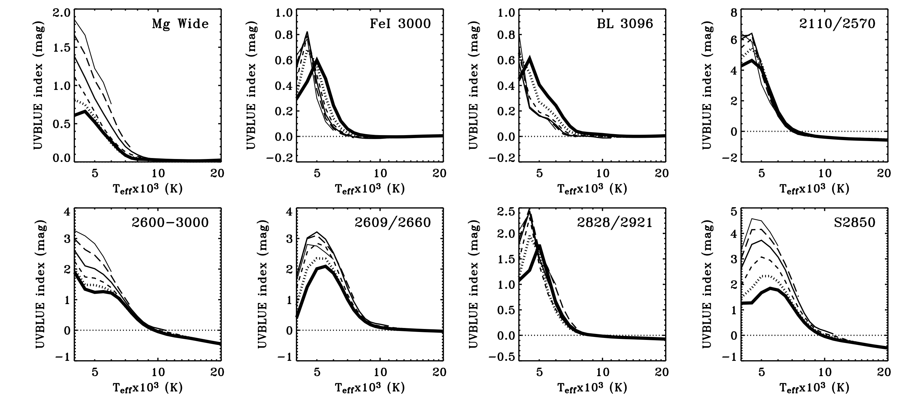

# 第6周汇报

## 1.本周完成

**① iSpec 手册使用部分已全部翻译完毕**

**② 扩充紫外谱线的相关论文，作为待读**

- Synthetic Mid-UV Spectroscopic Indices of Stars [:book: ADS](https://ui.adsabs.harvard.edu/abs/2007ApJ...657.1046C/abstract)
- Absorption line indices in the UV. Empirical and theoretical stellar population models [:book: ADS](https://ui.adsabs.harvard.edu/abs/2009A%26A...493..425M/abstract)
- Spectral Synthesis in the Ultraviolet. III. The Spectral Morphology of Normal Stars in the Mid-Ultraviolet [:book: ADS](https://ui.adsabs.harvard.edu/abs/1990ApJ...364..272F/abstract)
- Spectral Synthesis in the Ultraviolet. IV. A Library of Mean Stellar Groups [:book: ADS](https://ui.adsabs.harvard.edu/abs/1992ApJS...82..197F/abstract)

**③ 精读以下文章**

- Synthetic Mid-UV Spectroscopic Indices of Stars [:book: ADS](https://ui.adsabs.harvard.edu/abs/2007ApJ...657.1046C/abstract)   
- Absorption line indices in the UV. Empirical and theoretical stellar population models [:book: ADS](https://ui.adsabs.harvard.edu/abs/2009A%26A...493..425M/abstract)

 

 

- 线指数敏感性的定性分析
  - 有效温度
  - $log\text{ }g$
  - 电离态

**④ 确定线指数定量分析方法**
  
与杜薇师姐的相似

- 线指数

$$I = -2.5 log\frac{\int_{\lambda_1}^{\lambda_2}F_i(\lambda)d\lambda}{\int_{\lambda_1}^{\lambda_2}F_c(\lambda)d\lambda}$$

- 连续谱指数

$$I = -2.5 log\frac{\bar{F}_b(\lambda)}{\bar{F}_r(\lambda)}$$

**⑤ 后续工作路线**

- 沿着 'Synthetic Mid-UV Spectroscopic Indices of Stars' 这篇文章的思路，对合成光谱做定量分析

  

## 2.问题所在

- Spectral Morphology ?
- BL 指 **blend**

  

## 3.下周计划

- 整理相关信息，写一个紫外光谱及其线指数方面小的文献综述 :zap:
