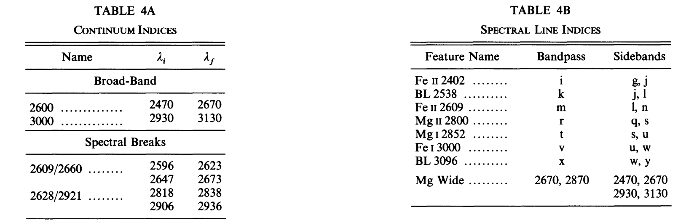
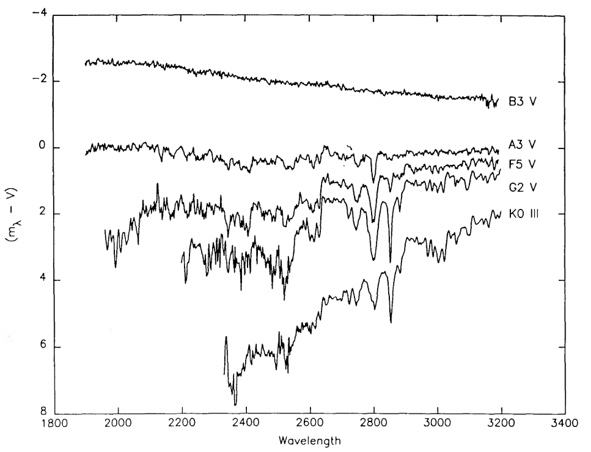
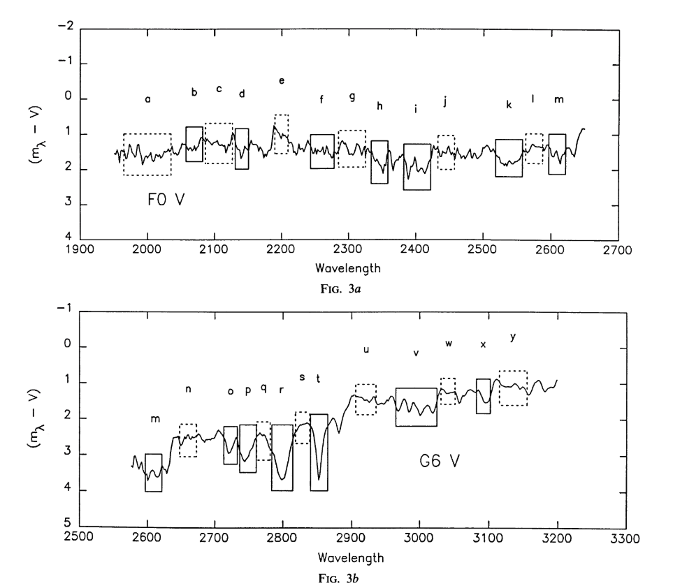
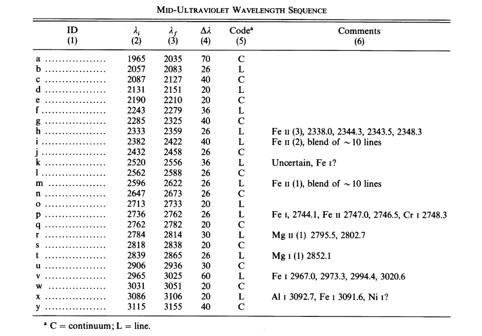
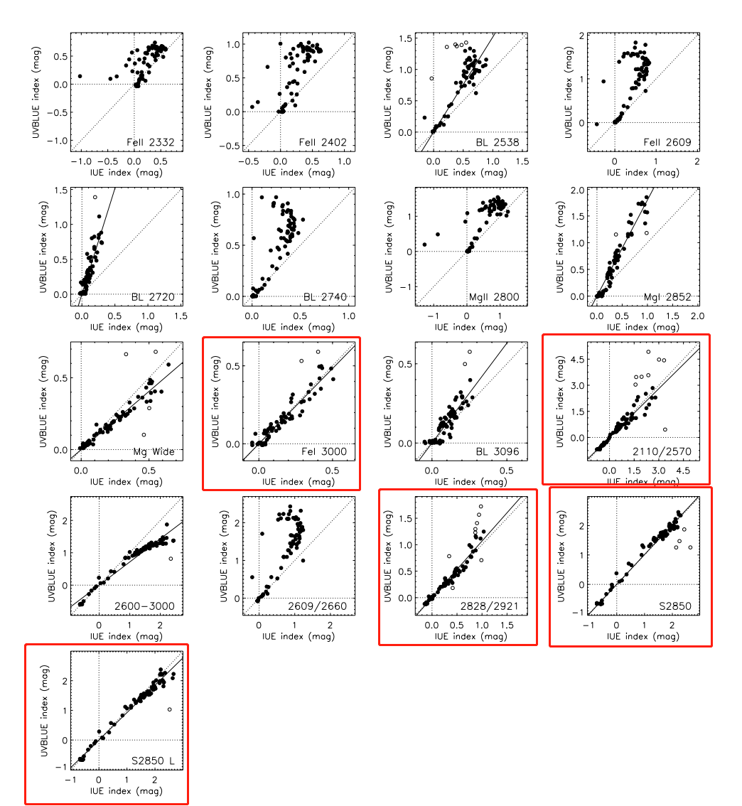
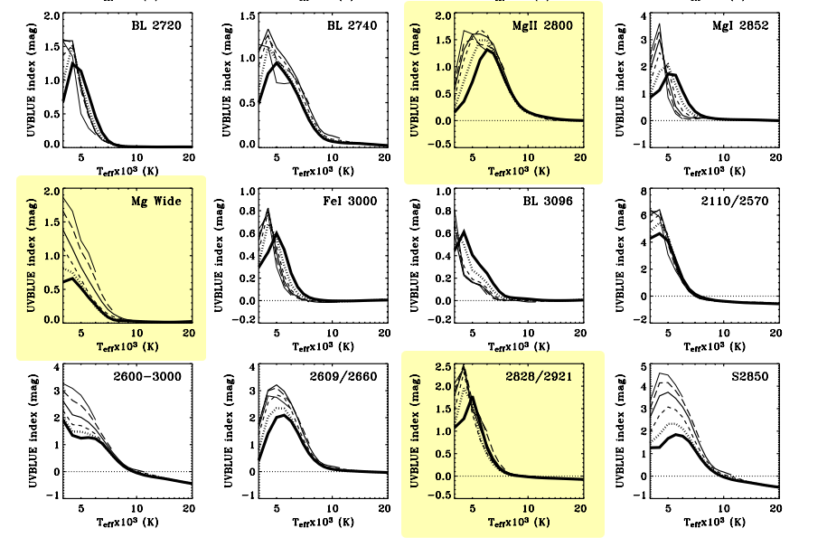

## 1.本周完成

- iSpec 使用手册的翻译工作全部完成 —— [iSpec 中文使用手册](https://iscottmark.gitee.io/ispec/)
- 读相关文献

## 2.具体内容

### ①主要特征线定义

### ②中紫外光谱的一般形态

IUE 实测光谱（已归一化到光学的 V 波段）

### ③线指数 & 连续谱指数

### ④与实测谱比较

- Fe I 3000, 2110/2570, 2828/2921, S2850, S2850L 共 5 个指数，表现出与 IUE 指数良好的一致性。

### ⑤3 根强特征线

- Mg II 2800，中紫外波段最强的特征
- Mg Wide，Teff 的指示特征 (I 随温度单调递减)
- 2828/2921，中紫外冷星最突出的特征

### ⑥简单总结

- 中紫外波段适合用于 A-K 类矮星 (高 log g) 的研究。
- 线指数和连续谱指数都显现出与颜色很好的相关性，且指数的值比在光学波段中的定义更大。由于中紫外光谱线指数对金属丰度不敏感，进一步能让这些线指数作为温度的判别式并用于星族的复合光谱研究之中。
- logg 无法成为主要的判别式。
- 谱线在中紫外波段中有着相对较高的温度敏感性，以及连续谱的强金属丰度敏感性，
- 在经历长时间爆发或 quasi-continuous 恒星形成的星族中，Fe II 和 Mg II 是 AF 恒星显著的标志。
- Mg II 发射线可作为年龄的指示。

## 3.下周计划

- 继续读论文
- 结合数据做简单校验
